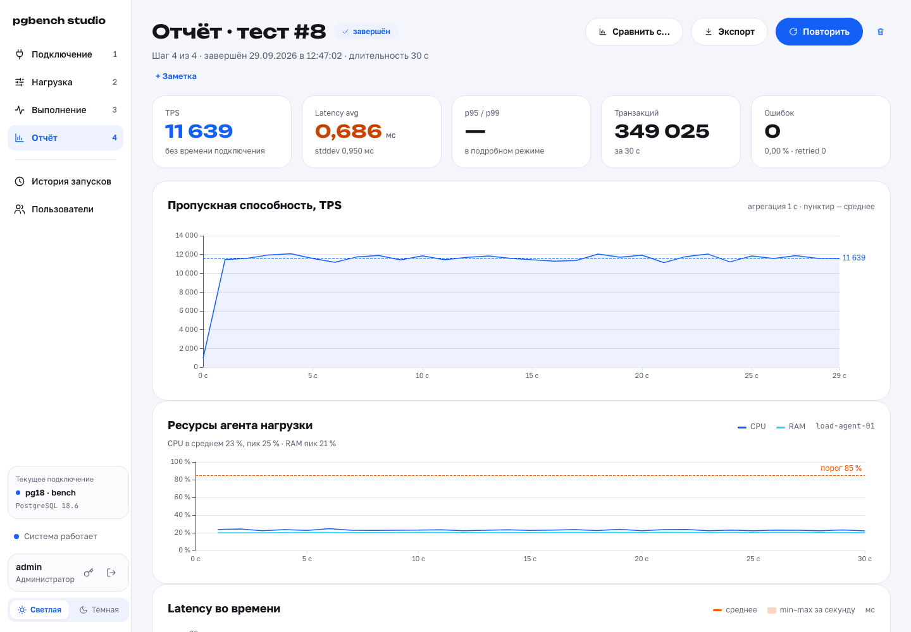
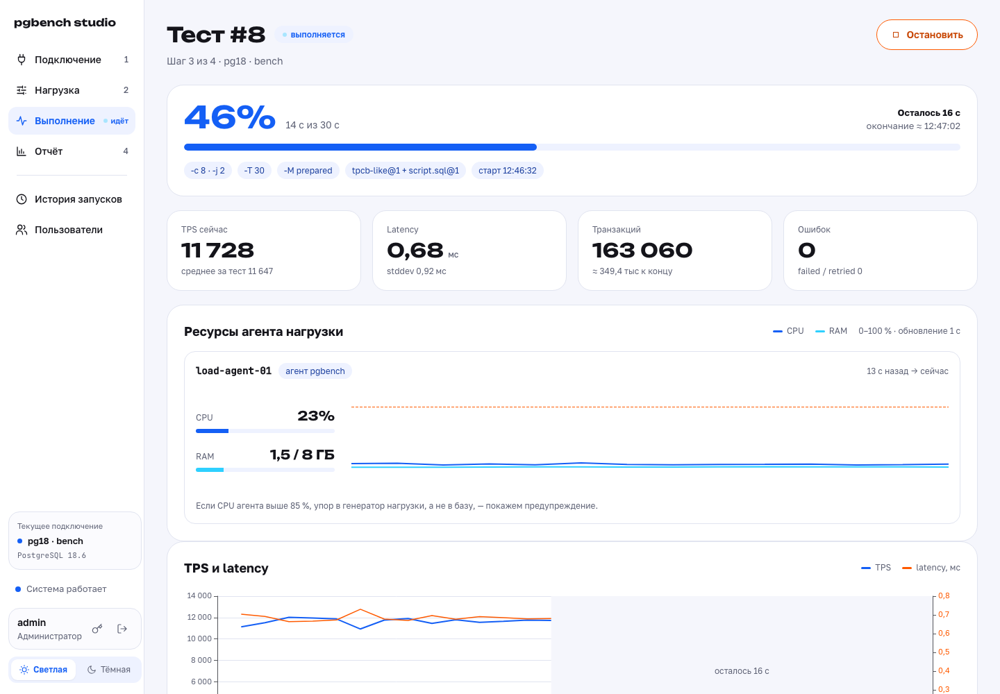
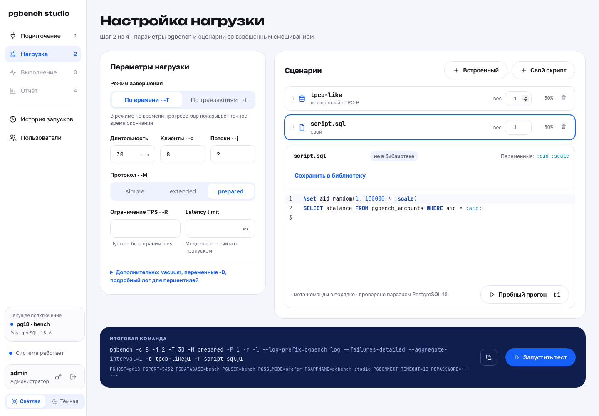
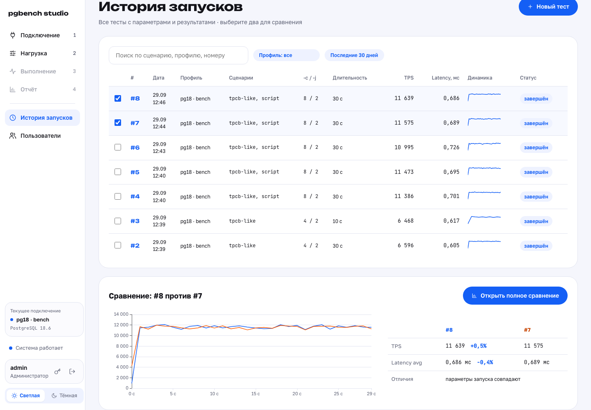
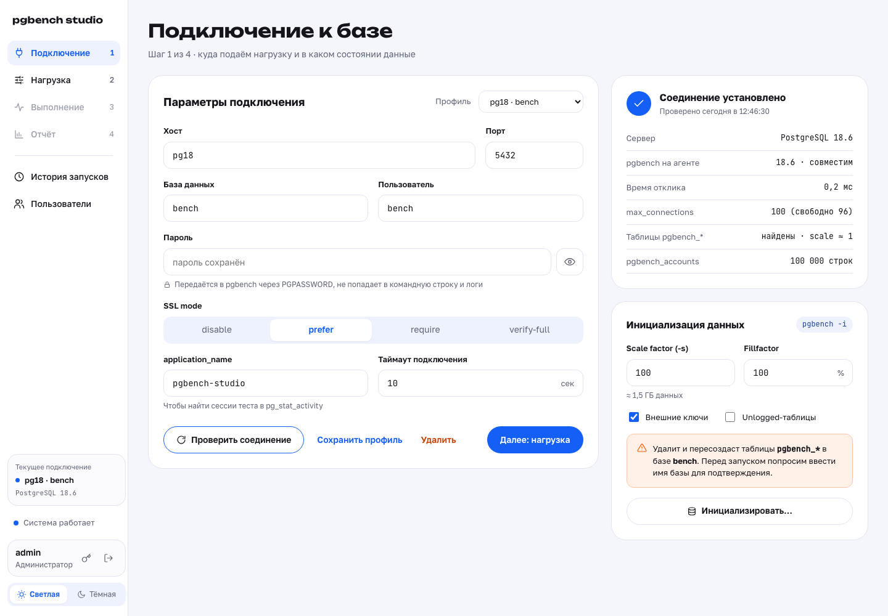

<div align="center">

# pgbench studio

**Нагрузочные тесты PostgreSQL без командной строки**

[](https://github.com/GeraltLybia/pgbench-studio/actions/workflows/ci.yml)


</div>

pgbench studio превращает pgbench в понятный веб-инструмент. Выберите базу, задайте нагрузку и сценарии, нажмите «Запустить». Через минуту у вас готов отчёт с графиками, который не стыдно показать команде. Не нужно помнить флаги, собирать логи по потокам и строить графики в таблицах: студия делает это сама и хранит историю каждого прогона.

Главное — база в безопасности. Каждый сценарий разбирается настоящим парсером PostgreSQL ещё до запуска. `DROP DATABASE`, `ALTER SYSTEM` и команды оболочки запрещены. `TRUNCATE` или `DELETE` без `WHERE` запускаются только после явного подтверждения, и оно сохраняется вместе с логином. Лимиты на соединения, длительность и объём данных проверяются и в интерфейсе, и на сервере: обойти их запросом в обход UI не получится.

Во время теста видно всё: прогресс с точным временем окончания, TPS и latency каждую секунду, живые логи и нагрузку на сам агент. Студия предупредит, если упор оказался в генератор нагрузки, а не в базу. После теста — отчёт с точными цифрами pgbench, задержками по каждому запросу, перцентилями и гистограммой. Два прогона можно положить рядом и увидеть разницу в процентах: помог ли индекс, что дала новая настройка, как ведёт себя PostgreSQL 13 против 18.

<picture>
  <source media="(prefers-color-scheme: dark)" srcset="docs/screenshots/dark-05-report.png">
  
</picture>

| Выполнение | Нагрузка и редактор сценариев |
| --- | --- |
| <picture><source media="(prefers-color-scheme: dark)" srcset="docs/screenshots/dark-04-run.png"></picture> | <picture><source media="(prefers-color-scheme: dark)" srcset="docs/screenshots/dark-03-load.png"></picture> |
| **История и сравнение** | **Подключение** |
| <picture><source media="(prefers-color-scheme: dark)" srcset="docs/screenshots/dark-06-history.png"></picture> | <picture><source media="(prefers-color-scheme: dark)" srcset="docs/screenshots/dark-02-connect.png"></picture> |

Светлая и тёмная тема — скриншоты выше следуют теме GitHub. Все экраны: [docs/screenshots](docs/screenshots).

## Возможности

- **Подключение.** Профили баз (пароли хранятся зашифрованными), проверка соединения с понятной причиной ошибки, свободные соединения и данные pgbench, инициализация `pgbench -i` с подтверждением именем базы.
- **Нагрузка.** Все основные параметры pgbench, встроенные сценарии и свои скрипты с весами, редактор с подсветкой и проверкой SQL на лету, пробный прогон `-t 1`, итоговая команда перед запуском.
- **Защита базы.** Правила опасного SQL по дереву запроса, лимиты нагрузки, сводка с подтверждениями; всё повторяется на бэкенде.
- **Выполнение.** Прогресс и время окончания, TPS и latency раз в секунду, CPU и RAM агента, живые логи; переподключение без потери данных, остановка за секунды.
- **Отчёт.** Итог pgbench до последнего знака, графики из лога `-l` (в том числе при `-j > 1`), задержки по запросам `-r`, гистограмма и p50/p95/p99 в подробном режиме, сырой вывод и файлы запуска.
- **История и сравнение.** Поиск и фильтры, спарклайны, наложенные графики и разница в процентах, различия параметров, заметки, «Повторить» с теми же сценариями.
- **Доступ.** Вход по логину, роли `viewer` / `editor` / `admin`, управление пользователями из интерфейса.

## Быстрый старт

Нужны Docker с Compose v2 и машина-агент рядом с тестируемой базой (не на ней).

```bash
git clone https://github.com/GeraltLybia/pgbench-studio.git && cd pgbench-studio
cp config.example.yaml config.yaml
cp .env.example .env
docker run --rm $(docker build -q backend) studio gen-key   # ключ для PGB_STUDIO_SECRET_KEY
```

В `.env` задайте `PGB_STUDIO_SECRET_KEY` (ключ из команды выше) и `PGB_STUDIO_ADMIN_PASSWORD` — пароль первого администратора. Бэкенд работает в контейнере от пользователя с uid/gid 10001, поэтому каталог данных нужно отдать ему:

```bash
mkdir -p data && sudo chown 10001:10001 data
docker compose up -d --build
docker compose ps          # все сервисы healthy
```

Приложение — на порту `FRONTEND_PORT` (по умолчанию 8080). В составе compose есть тестовые базы PostgreSQL 13 и 18 (`pg13:5432`, `pg18:5432`, пользователь и база `bench`, пароль `PGB_TEST_DB_PASSWORD`) — на них удобно попробовать студию. Для боевого развёртывания их можно убрать из `docker-compose.yml`.

Без HTTPS (локально, на своей машине) в `config.yaml` включите `server.dev_mode: true` и `auth.cookie_secure: false`. В остальных случаях студия работает за HTTPS-балансировщиком, см. ниже.

## Конфигурация

`config.yaml` монтируется в бэкенд только для чтения. Любое поле переопределяется переменной окружения `PGB_STUDIO_<СЕКЦИЯ>__<ПОЛЕ>`, например `PGB_STUDIO_LIMITS__MAX_SCALE=1000`. Ошибка в конфиге останавливает бэкенд с понятным сообщением.

| Секция | Параметры |
| --- | --- |
| `server` | `trusted_proxies` — адреса балансировщика, только им верим `X-Forwarded-*`; `dev_mode` — HTTP без Secure-cookie для локальной работы |
| `auth` | срок сессии, `cookie_secure`, блокировка после неудачных входов (`max_failed_logins`, `lockout_min`), переменные первого администратора |
| `storage` | `sqlite_path`, `runs_dir` (логи и файлы запусков), `keep_runs_days` — запуски старше удаляются раз в сутки |
| `pgbench` | путь к pgbench, `max_parallel_runs`, интервал прогресса |
| `agent` | имя агента, частота замеров, порог CPU для предупреждения |
| `limits` | резерв соединений, максимальная длительность и число транзакций, максимальный scale, минимум свободного места |

`.env`:

| Переменная | Назначение |
| --- | --- |
| `PGB_STUDIO_SECRET_KEY` | ключ шифрования паролей профилей (Fernet), обязателен: без него бэкенд не стартует |
| `PGB_STUDIO_ADMIN_USER`, `PGB_STUDIO_ADMIN_PASSWORD` | первый администратор, создаётся при старте, если пользователей нет |
| `TRUSTED_PROXIES` | адреса балансировщика для nginx, те же, что `server.trusted_proxies` |
| `FRONTEND_PORT` | порт приложения на машине-агенте |
| `PGB_TEST_DB_PASSWORD` | пароль тестовых баз pg13 и pg18 |

Ключ шифрования храните отдельно от данных: при его потере сохранённые пароли профилей придётся ввести заново.

### HTTPS и балансировщик

HTTPS терминируется на балансировщике перед машиной-агентом. От него нужно:

- проксировать всё на порт `FRONTEND_PORT` и передавать `X-Forwarded-Proto`, `X-Forwarded-For`, `X-Forwarded-Host`;
- пропускать WebSocket (`Upgrade`, `Connection`) с таймаутом простоя больше 30 с (фронт шлёт ping раз в 30 с);
- перенаправлять HTTP на HTTPS и включить HSTS;
- быть единственной дорогой к порту агента (firewall или security group).

Адреса балансировщика укажите в `server.trusted_proxies` и `TRUSTED_PROXIES`. Бэкенд отклоняет изменяющие запросы, пришедшие не по HTTPS, а в логах и блокировке входа использует реальный IP клиента.

### Аварийный доступ

Если все администраторы потеряли доступ:

```bash
docker compose exec backend studio users reset-admin
```

## Роли

| Действие | viewer | editor | admin |
| --- | :---: | :---: | :---: |
| История, отчёты, сравнение, наблюдение за тестом | ✓ | ✓ | ✓ |
| Профили подключения, проверка, `pgbench -i` |  | ✓ | ✓ |
| Сценарии, запуск и остановка тестов, удаление запусков, заметки |  | ✓ | ✓ |
| Пользователи: создание, роли, блокировка, сброс пароля |  |  | ✓ |

Права проверяются на бэкенде; интерфейс лишь скрывает недоступные кнопки. Для тестов рекомендуем отдельного пользователя БД без прав суперпользователя — это последний рубеж, если правило что-то пропустит.

## Ограничения

- Один агент и один запуск за раз; распределённой нагрузки нет.
- Ресурсы (CPU, RAM) снимаются только с машины-агента, сервер БД не мониторится.
- Серверы PostgreSQL 13–18, клиент — pgbench 18 на агенте: так результаты разных версий сравнимы.
- Нет SSO и запуска по расписанию.
- pgbench 18.6 не печатает итог после остановки (SIGINT) и после обрыва клиента ошибкой SQL; для таких запусков графики строятся по строкам `progress`.
- Проверка SQL ловит опасные конструкции по дереву запроса, но не заменяет права пользователя БД.

## Разработка

Бэкенд — Python 3.12, FastAPI, SQLite; фронтенд — Vue 3, TypeScript, Vite, ECharts, CodeMirror 6. Архитектура и принятые решения — [docs/architecture.md](docs/architecture.md) и [docs/PLAN.md](docs/PLAN.md).

```bash
# бэкенд (из backend/)
uv sync
uv run ruff check . && uv run ruff format --check . && uv run mypy app
uv run pytest --cov=app --cov-report=json && uv run python scripts/check_coverage.py
uv run pytest -m integration          # Docker + pgbench 18 (PGBENCH_BINARY), PostgreSQL 13 и 18

# фронтенд (из frontend/)
pnpm install
pnpm lint && pnpm typecheck && pnpm test
pnpm gen:api                          # типы API из OpenAPI бэкенда

# e2e против поднятого compose (из frontend/)
E2E_ADMIN_PASSWORD=… pnpm e2e
SCREENSHOTS=../docs/screenshots E2E_ADMIN_PASSWORD=… pnpm e2e screens   # скриншоты для README
```

CI на каждый PR: линтеры и unit-тесты с порогами покрытия, интеграционные тесты с настоящим pgbench 18 против PostgreSQL 13 и 18, Playwright e2e на поднятом стенде и сборка образов.
